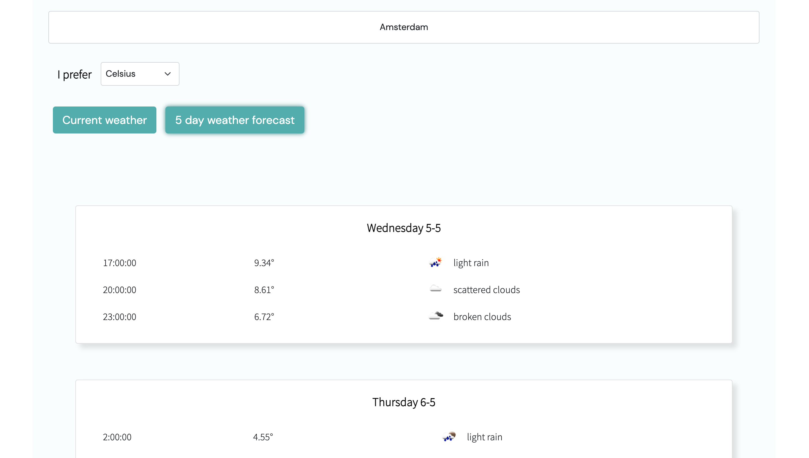

# Weather app

This Weather app is a React app to show the current weather and the 5 day weather forecast.  

## Local development

### API key

To use the Weather app go to https://home.openweathermap.org/ to get your (free) API key.

Create an .env file in the root. 
In that file, you store your personal API key like this:

```
REACT_APP_WEATHER_API_KEY=your_api_key
```

### Start server

```
npm install
npm start
```

Open http://localhost:3000/ to see your app.

### Screenshot


